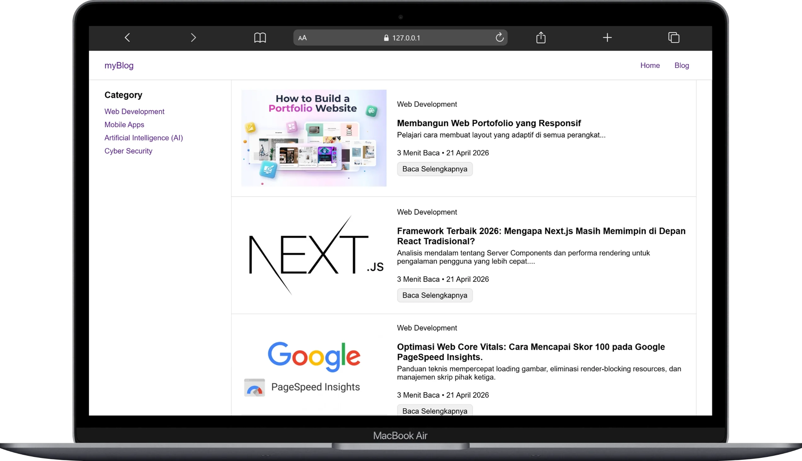

# myBlog

myBlog is a personal website built with HTML, CSS, and JavaScript that presents content structured by category, featuring a responsive layout and optimal user interaction.

🔗 Live Website: https://my-blog-rizkiardi.vercel.app/



## 🛠 Tech Stack

- HTML
- CSS
- JavaScript

### Deployment

- Vercel

## 🚀 Getting Started

Clone the project

```bash
  git clone https://github.com/rizzkiardi/my-blog.git
```

Go to the project directory

```bash
  cd my-blog
```

Open in browser

```bash
  http://127.0.0.1:5500/index.html
```

## 📝 License

© 2026 Rizki Ardi. All rights reserved.
